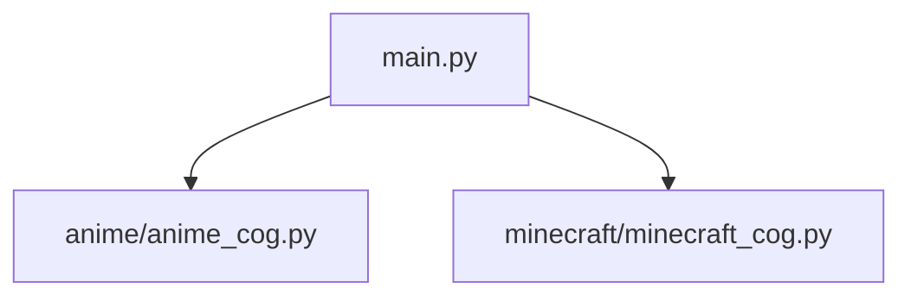

# Discordのボット

## 構成
`main.py`がメイン部分。以下の図のように`main.py`でそれぞれの`Cog`を読み込んでいる

```mermaid
graph TD;
    main.py-->anime/anime_cog.py;
    main.py-->minecraft/minecraft_cog.py;
```

オセロとYoutube再生機能は現在は廃止中

## デプロイ
mainブランチが更新されると自動で[Railway](https://railway.app/)にデプロイされる仕組み